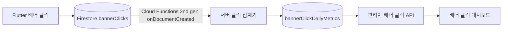

# 배너 클릭 통계 및 관리자 대시보드 설계

## 1. 결정 사항

배너 대시보드는 노출수와 CTR을 수집하지 않고 클릭 데이터만 사용한다.

관리자에게 제공할 핵심 값은 다음과 같다.

- 전체 클릭수
- 배너별 클릭수
- 위치별 클릭수
- 모델·디자이너별 클릭수
- 일별 클릭 추세
- 이전 기간 대비 클릭 증감
- 클릭 점유율

여기서 `클릭 점유율`은 선택한 기간과 필터 안에서 특정 배너 또는 위치의 클릭이 전체 클릭 중 차지하는 비중이다.

```text
클릭 점유율 = 해당 배너 또는 위치 클릭수 / 같은 필터의 전체 클릭수 × 100
```

노출수가 없으므로 이 값을 CTR 또는 광고 효율이라고 부르지 않는다. 클릭 점유율은 클릭이 어디에 몰렸는지를 보여주지만, 노출 기회가 서로 다른 위치의 효율을 직접 비교하지는 못한다.

## 2. 구현 가능 여부

구현을 막는 기술적 장애물은 없다. 현재 `bannerClicks` 원본 로그에 배너 ID와 서버 클릭 시각이 저장되므로 과거 배너별 클릭수도 집계할 수 있다.

다만 다음 원칙을 지켜야 한다.

1. 기존 `bannerAnalytics`와 `bannerSummary`를 대시보드 원본으로 사용하지 않는다.
2. `bannerClicks` 원본 로그를 기준으로 기존 집계를 다시 만든다.
3. 신규 클릭에는 실제 화면 위치를 나타내는 `placementId`를 추가한다.
4. Flutter 앱은 원본 클릭만 기록하고 일·주·월 집계는 서버가 처리한다.
5. 관리자 웹은 Firestore를 직접 조회하지 않고 관리자 API를 사용한다.

이 방식이면 현재 클릭 데이터는 버리지 않고 활용하면서 신규 데이터의 위치 분석 정확도를 개선할 수 있다.

## 3. 현재 데이터 수집 구조

### 3.1 원본 클릭 로그

Flutter의 `lib/provider/firestore_banner_click_provider.dart`는 클릭할 때 `bannerClicks`에 다음 데이터를 추가한다.

```json
{
  "bannerId": "16",
  "userType": "모델",
  "bannerType": "일반",
  "displayType": ".",
  "imageUrl": "https://...",
  "redirectUrl": "https://...",
  "userId": "71297",
  "clickedAt": "server timestamp",
  "platform": "flutter"
}
```

원본 로그의 장점은 다음과 같다.

- `clickedAt`이 Firestore 서버 타임스탬프다.
- 배너 ID가 있어 배너별 과거 클릭수를 복원할 수 있다.
- 모델·디자이너와 `bannerType` 구분이 있다.
- 이미지와 링크 스냅샷이 남아 있다.

### 3.2 현재 클라이언트 집계

원본 저장 후 Flutter 앱이 다음 통계를 직접 갱신한다.

| 컬렉션 또는 하위 컬렉션 | 원래 목적                                           | 관리자 화면에서 기대하는 사용법           |
| ----------------------- | --------------------------------------------------- | ----------------------------------------- |
| `bannerClicks`          | 클릭 한 번마다 남기는 변경 불가능한 원본 이벤트     | 집계 복구, 대사, 상세 조사 기준           |
| `bannerAnalytics`       | 배너별 일·주·월 통계를 미리 계산한 조회용 데이터    | 원본 전체를 매번 읽지 않고 기간 차트 조회 |
| `bannerSummary`         | 배너별 누적 통계와 현재 기간 요약을 한 문서에 보관  | KPI 카드와 배너 목록을 빠르게 조회        |
| `userStats`             | 기간 또는 누적 순클릭 사용자와 사용자별 클릭수 계산 | 순클릭 사용자 지표 조회                   |
| `timeslots`             | 일별 클릭을 더 짧은 시간 단위로 분해                | 시간대별 클릭 분포 조회                   |

관리자 대시보드에는 이 클라이언트 집계를 그대로 사용하지 않는다.

`bannerAnalytics`와 `bannerSummary` 같은 사전 집계 개념 자체는 잘못되지 않았다. 문제는 앱 클라이언트가 원본 저장과 여러 집계 갱신을 서로 다른 작업으로 수행하고, 기간 전환과 동시 클릭을 안전하게 처리하지 못한다는 점이다. 따라서 현재 문서는 `bannerClicks`를 원본으로 보고 서버가 관리하는 하나의 일별 집계로 대체하는 방식을 권장한다.

## 4. 현재 구조에서 확인된 이슈

### [P1] `periodStats`가 기간이 바뀌어도 초기화되지 않는다

위치: `meemong-flutter-app/lib/provider/firestore_banner_click_provider.dart:401`

`today`, `thisWeek`, `thisMonth`, `thisYear` 값을 증가시키지만 해당 값이 어느 날짜·주·월·연도에 속하는지 저장하거나 기간 변경 시 초기화하는 로직이 없다.

영향:

- `today.clicks`가 오늘 클릭수가 아니라 문서 생성 후 누적 클릭수가 될 수 있다.
- 주·월·연도 값도 같은 문제가 발생한다.
- 현재 `bannerSummary.periodStats`는 대시보드 지표로 신뢰하기 어렵다.

대응:

- `bannerSummary.periodStats`는 사용하지 않는다.
- 원본 `bannerClicks.clickedAt`으로 일별 집계를 다시 만든다.

### [P1] 원본과 집계가 서로 다른 작업으로 저장된다

위치: `meemong-flutter-app/lib/provider/firestore_banner_click_provider.dart:40`

원본 클릭 저장 후 별도 비동기 작업으로 여러 집계 문서를 갱신한다. 집계 실패는 로그만 남기고 종료한다.

영향:

- 원본 클릭은 존재하지만 일·주·월 또는 요약 집계가 빠질 수 있다.
- 일부 집계만 성공해 기간별 숫자가 서로 다를 수 있다.
- 앱에서 실패 집계를 재처리할 수 없다.

대응:

- 원본 클릭만 앱에서 저장한다.
- 서버 집계 실패는 재처리 가능한 상태로 관리한다.

### [P1] 통계 문서 최초 생성 시 동시 클릭을 잃을 수 있다

위치: `meemong-flutter-app/lib/provider/firestore_banner_click_provider.dart:101`

문서 존재 여부를 읽은 뒤 존재하지 않으면 클릭수 1인 문서를 생성한다. 같은 시점에 두 클라이언트가 최초 클릭을 처리하면 둘 다 문서가 없다고 판단하고 1로 덮어쓸 수 있다.

영향:

- 원본 클릭은 2개지만 집계는 1이 될 수 있다.

대응:

- 집계는 서버 트랜잭션 또는 멱등 집계 작업으로 처리한다.
- 기존 집계가 아니라 원본 로그를 신뢰한다.

### [P1] 위치별 분석에 필요한 값이 없다

위치: `meemong-flutter-app/lib/provider/firestore_banner_click_provider.dart:28`

현재 `bannerType`만 저장하며 실제 화면 위치는 저장하지 않는다. 디자이너 `일반` 배너는 홈 캐러셀과 미디어 화면에서 모두 사용되므로 `bannerType=일반`만으로 어느 화면의 클릭인지 구분할 수 없다.

영향:

- 기존 디자이너 일반 배너 클릭은 홈과 미디어로 분리할 수 없다.
- 배너 ID가 같은 소재가 여러 위치에 나오면 배너별 클릭수는 알 수 있지만 위치별 클릭수는 알 수 없다.

대응:

- 신규 클릭에 `placementId`를 필수 저장한다.
- 과거 위치가 불명확한 데이터는 `legacy_general_unknown`으로 분류한다.

### [P1] 기간별 순클릭 사용자 수가 누적 사용자 판정에 의존한다

위치: `meemong-flutter-app/lib/provider/firestore_banner_click_provider.dart:356`

`bannerSummary/userStats/{userId}` 존재 여부로 lifetime 신규 사용자를 판정한 뒤 오늘·이번 주·이번 달 순사용자 수에도 같은 판정을 사용한다.

영향:

- 과거에 한 번이라도 클릭한 사용자는 새로운 날짜에 클릭해도 오늘 순클릭 사용자에 포함되지 않는다.
- 현재 기간별 순사용자 값은 실제보다 작을 수 있다.

대응:

- 1차 클릭 대시보드에서 순클릭 사용자를 제외한다.
- 필요해지면 서버에서 익명화 사용자 키로 별도 집계한다.

### [P2] 집계 시간대가 클라이언트 시각에 의존한다

위치: `meemong-flutter-app/lib/provider/firestore_banner_click_provider.dart:26`

원본 클릭은 서버 타임스탬프지만 집계 날짜는 기기의 `DateTime.now()`를 UTC로 바꾼 값으로 계산한다.

영향:

- 기기 시각이 틀리면 잘못된 날짜에 집계될 수 있다.
- UTC와 KST 날짜 경계에서 요약 통계 조건이 어긋날 수 있다.

대응:

- 서버가 `clickedAt`을 기준으로 `Asia/Seoul` 날짜 키를 만든다.

### [P2] 클릭 기록 완료를 기다리지 않고 화면을 이동한다

위치:

- `meemong-flutter-app/lib/presentation/widgets/banner_widget.dart:108`
- `meemong-flutter-app/lib/presentation/widgets/banner_carousel_widget.dart:156`
- `meemong-flutter-app/lib/presentation/widgets/ad_banner_bottom_sheet.dart:79`

클릭 기록 Future를 기다리지 않고 URL을 연다. 인앱 브라우저에서는 대부분 정상 동작하겠지만 앱이 바로 종료되거나 프로세스가 중단되면 기록 완료가 보장되지 않는다.

대응:

- 클릭 반응을 지연시키지 않는 현재 UX는 유지한다.
- Firestore 오프라인 큐 또는 서버 수집 요청 큐를 사용한다.
- 실패율을 확인할 수 있는 진단 로그를 추가한다.

### [P2] 사용자 ID와 URL이 원본 분석 로그에 직접 저장된다

위치: `meemong-flutter-app/lib/provider/firestore_banner_click_provider.dart:28`

내부 관리자용 Firestore가 엄격히 보호된다면 운영 가능하지만 광고주에게 원본 데이터를 제공해서는 안 된다.

대응:

- 1차 대시보드는 총 클릭수만 사용하므로 신규 로그에서 `userId`를 제거할 수 있다.
- 순클릭 사용자가 필요해질 때 서버가 HMAC 기반 `actorKey`를 생성한다.
- 광고주 API에는 사용자 수준 데이터를 노출하지 않는다.

### [P2] 분석 보안 규칙을 저장소에서 검증할 수 없다

위치:

- `meemong-flutter-app/firebase.json`
- `meemong-flutter-app/BANNER_ANALYTICS_DOCUMENTATION.md:440`

저장소에 실제 `firestore.rules`가 없고 기존 문서 예시는 분석 컬렉션에 `allow read, write: if true`를 사용한다. 실제 운영 규칙이 공개 상태라는 뜻은 아니지만 코드 기준으로 안전성을 확인할 수 없다.

대응:

- 실제 운영 규칙을 확인한다.
- 앱은 클릭 문서 create만 허용하고 read, update, delete는 차단한다.
- 관리자 조회는 서버의 Firebase Admin SDK에서만 수행한다.

### [P3] `bannerId` 타입과 문서 설명이 일치하지 않는다

코드에서는 `bannerId`를 문자열로 저장하지만 기존 문서 일부 예시는 숫자로 표현한다.

대응:

- 기존 컬렉션과 호환하기 위해 `bannerClicks.bannerId`는 문자열로 유지한다.
- 관리자 API 응답에서만 숫자로 정규화한다.
- 신규 집계 문서도 한 가지 타입으로 고정한다.

## 5. 클릭 전용 지표

### 5.1 1차 필수 지표

| 지표              | 정의                                       |
| ----------------- | ------------------------------------------ |
| 전체 클릭수       | 선택 기간과 필터 안의 클릭 문서 수         |
| 배너별 클릭수     | `bannerId`별 클릭수                        |
| 위치별 클릭수     | `placementId`별 클릭수                     |
| 일별 클릭수       | KST `dateKey`별 클릭수                     |
| 클릭 점유율       | 해당 배너 또는 위치 클릭수 / 전체 클릭수   |
| 이전 기간 대비    | 동일 길이 이전 기간과의 클릭수 증감률      |
| 클릭 발생 배너 수 | 선택 기간에 클릭이 1회 이상 발생한 배너 수 |
| 일평균 클릭수     | 전체 클릭수 / 선택 기간 일수               |

### 5.2 1차에서 제외할 지표

- CTR
- 노출수
- 순노출 사용자
- 노출 빈도
- 전환율
- CPC, CPM, ROAS
- 현재 구조의 순클릭 사용자 수

순클릭 사용자 수는 추후 서버 익명화 키와 정확한 기간 distinct 집계가 준비되면 추가한다.

### 5.3 클릭수 해석 주의사항

- 클릭수가 높아도 많이 노출돼서 높을 수 있으므로 배너 효율이 높다고 단정할 수 없다.
- 위치별 클릭수 차이는 위치 트래픽과 노출 방식의 영향을 함께 받는다.
- 광고주에게는 `클릭 성과`로 표현하고 `CTR` 또는 `노출 대비 효율`로 표현하지 않는다.
- 클릭 점유율은 같은 필터 범위 안의 분포 지표다.

## 6. 위치 식별자

위치별 분석을 위해 클릭 이벤트에 `placementId`를 추가한다.

| 사용자 유형   | `bannerType` | 실제 화면                 | `placementId`                    |
| ------------- | ------------ | ------------------------- | -------------------------------- |
| 모델          | 일반         | 모델 홈 상단 캐러셀       | `model_home_general_carousel`    |
| 디자이너      | 일반         | 디자이너 홈 상단 캐러셀   | `designer_home_general_carousel` |
| 디자이너      | 일반         | 디자이너 미디어 화면 상단 | `designer_media_top`             |
| 모델·디자이너 | 번개매칭     | 번개매칭 화면 상단        | `thunder_matching_top`           |
| 모델·디자이너 | 채팅배너     | 채팅 목록 상단            | `chat_list_top`                  |
| 모델          | 지도로보기   | 지도 화면 상단            | `model_map_top`                  |
| 모델·디자이너 | 바텀시트     | 앱 시작 광고 바텀시트     | `startup_bottom_sheet`           |

Flutter 코드에서는 문자열을 각 화면에 직접 쓰지 않고 `BannerPlacement` 상수 또는 enum을 사용한다.

## 7. 같은 위치의 배너 교체와 비교

같은 위치에 이번 주와 다음 주 서로 다른 배너를 운영해도 각각 분리해 비교할 수 있다. 클릭 데이터의 최소 식별 키를 다음처럼 구성한다.

```text
위치: placementId
배너: bannerId
기간: clickedAt에서 파생한 dateKey
```

### 7.1 배너 ID 운영 원칙

새 소재를 운영할 때마다 새 배너를 생성하고 새 ID를 발급한다. 클릭이 발생한 기존 배너의 이미지, 링크, 사용자 유형, 배너 유형은 수정해 재사용하지 않는다.

이 전제를 지키면 `bannerRevision`은 필요하지 않다. 이번 주와 다음 주 배너는 ID가 다르므로 현재 원본 클릭만으로도 배너별 클릭수를 분리할 수 있고, 신규 `placementId`를 추가하면 같은 위치의 주차별 비교도 가능하다.

| 운영 기간        | 위치           | 배너 ID | 클릭수 | 일평균 클릭수 |
| ---------------- | -------------- | ------: | -----: | ------------: |
| 7월 20일~26일    | 채팅 목록 상단 |     101 |    420 |          60.0 |
| 7월 27일~8월 2일 | 채팅 목록 상단 |     108 |    560 |          80.0 |

관리자 배너 수정 기능에서는 클릭 이력이 있는 배너의 분석 기준 필드 변경을 막거나, 변경 시 “기존 클릭과 합쳐진다”는 경고 후 새 배너 생성을 유도한다. 향후 같은 ID를 수정해 재사용하는 정책으로 바뀌는 경우에만 버전 또는 별도의 게재 ID를 도입한다.

### 7.2 클릭 전용 비교 방법

같은 위치에서 연속된 두 배너를 비교할 때는 다음 값을 사용한다.

- 같은 길이 기간의 총 클릭수
- 일평균 클릭수
- 이전 배너 대비 클릭수 증감률
- 해당 위치 전체 클릭 중 배너 클릭 점유율

기간 길이가 다르면 총 클릭수보다 일평균 클릭수를 우선한다. 노출수가 없으므로 “배너 B의 효율이 더 좋다”가 아니라 “같은 위치에서 배너 B가 더 많은 클릭을 발생시켰다”로 해석한다. 주차별 앱 방문자 수나 계절 요인이 달라질 수 있어 소재 자체의 효과만 분리한 비교는 아니다.

## 8. 권장 원본 클릭 구조

### 8.1 기존 컬렉션 유지

과거 데이터와 연결하기 위해 `bannerClicks` 컬렉션을 유지하고 신규 문서에 필드를 추가한다.

```text
bannerClicks/{eventId}
```

### 8.2 신규 클릭 문서

```json
{
  "eventId": "01J...",
  "trackingVersion": 2,
  "bannerId": "16",
  "audienceType": "MODEL",
  "bannerType": "일반",
  "placementId": "model_home_general_carousel",
  "clickedAt": "server timestamp",
  "occurredAt": "client timestamp",
  "platform": "IOS",
  "appVersion": "5.3.0",
  "environment": "PROD",
  "aggregationStatus": "PENDING"
}
```

### 8.3 필드 원칙

- `eventId`는 클릭 한 번의 고유 ID이며 재시도에도 같은 값을 사용한다.
- Firestore 문서 ID도 `eventId`로 사용해 중복 생성을 방지한다.
- `bannerId`는 기존 데이터와 맞춰 문자열로 유지한다.
- `audienceType`은 `MODEL`, `DESIGNER`로 통일한다.
- `placementId`는 실제 화면 위치다.
- `clickedAt`은 서버 타임스탬프이며 집계의 기준 시각이다.
- `occurredAt`은 오프라인 지연과 기기 시각 오류를 진단하기 위한 보조 값이다.
- `environment=PROD`만 운영 대시보드에 포함한다.
- 1차 총 클릭수만 필요하면 신규 문서에 사용자 ID를 저장하지 않는다.
- 이미지와 링크는 배너 API에서 조회하며 이벤트마다 복제하지 않는다.

### 8.4 기존 필드 호환

구버전 앱은 현재 구조로 계속 기록할 수 있다. 서버 집계기는 다음처럼 버전을 구분한다.

| 구분 | 판정                   | 처리                                           |
| ---- | ---------------------- | ---------------------------------------------- |
| v1   | `trackingVersion` 없음 | 기존 필드 파싱, 위치는 매핑 가능한 범위만 사용 |
| v2   | `trackingVersion=2`    | `placementId`, `audienceType`, `eventId` 사용  |

## 9. 권장 집계 구조

### 9.1 아키텍처



앱은 `bannerAnalytics`와 `bannerSummary`를 더 이상 갱신하지 않는다.

Firestore가 일별 통계를 자체적으로 만들어 주는 것은 아니다. `bannerClicks/{eventId}`가 생성되면 같은 Firebase 프로젝트에 배포한 Cloud Functions 2세대의 `onDocumentCreated` 함수가 실행되어 일별 집계 문서를 갱신한다.

### 9.2 클릭 발생 시 일별 집계

클릭 한 번의 처리 순서는 다음과 같다.

1. Flutter 앱이 `bannerClicks/{eventId}` 원본 문서를 생성한다.
2. Cloud Functions의 `onDocumentCreated("bannerClicks/{eventId}")`가 실행된다.
3. 함수가 서버 `clickedAt`을 `Asia/Seoul` 기준 `dateKey`로 변환한다.
4. 함수가 `dateKey + bannerId + placementId + audienceType`에 해당하는 일별 문서를 찾는다.
5. Firestore 트랜잭션으로 `clickCount`를 1 증가시키고 원본 이벤트를 `PROCESSED`로 표시한다.

일별 집계 문서 구조는 다음과 같다.

```text
bannerClickDailyMetrics/{dateKey}__b{bannerId}__{placementId}__{audienceType}
```

```json
{
  "dateKey": "2026-07-27",
  "timezone": "Asia/Seoul",
  "bannerId": "16",
  "audienceType": "MODEL",
  "bannerType": "일반",
  "placementId": "model_home_general_carousel",
  "clickCount": 310,
  "firstClickedAt": "timestamp",
  "lastClickedAt": "timestamp",
  "updatedAt": "timestamp",
  "trackingVersion": 2
}
```

클릭 점유율과 증감률은 집계 문서에 저장하지 않고 관리자 API가 정수 클릭수를 합산한 뒤 계산한다.

### 9.3 주·월·전체 클릭수 계산 시점

1차 구현에서는 주별·월별·전체 집계 문서를 별도로 만들지 않는다. 관리자가 대시보드를 열거나 기간·배너·위치 필터를 변경할 때 관리자 API가 `bannerClickDailyMetrics`를 조회해 계산한다.

```text
최근 7일 클릭수 = 선택한 7개 dateKey의 clickCount 합계
월간 클릭수 = 해당 월 dateKey 범위의 clickCount 합계
전체 클릭수 = 사용자가 선택한 조회 기간의 clickCount 합계
```

관리자 API는 Firestore의 `sum(clickCount)` 집계 쿼리를 사용하거나, 일별 추세를 위해 조회한 문서의 `clickCount`를 서버에서 합산할 수 있다. 같은 요청에서 일별 추세도 필요하다면 조회한 일별 문서를 한 번 합산하는 쪽이 단순하다.

즉, 처리 시점은 다음 두 가지로 나뉜다.

| 시점             | 처리 내용                                   | 실행 주체                       |
| ---------------- | ------------------------------------------- | ------------------------------- |
| 클릭 발생 직후   | 해당 날짜의 `clickCount` 1 증가             | Firestore 트리거 Cloud Function |
| 대시보드 조회 시 | 선택 기간의 일별 클릭수를 주·월·전체로 합산 | 관리자 API                      |

데이터가 커져 조회 비용이나 지연이 문제가 될 때만 주별·월별 집계를 추가한다. 그전에는 일별 집계 하나를 기준으로 삼아 서로 다른 집계 문서가 불일치하는 문제를 줄인다. 필요하면 관리자 API 응답을 짧게 캐시할 수 있다.

### 9.4 집계 멱등성

Firestore 트리거는 재시도될 수 있으므로 같은 클릭을 두 번 더하지 않아야 한다.

권장 트랜잭션:

1. 원본 클릭의 `aggregationStatus`를 읽는다.
2. 이미 `PROCESSED`면 종료한다.
3. 일별 집계 `clickCount`를 1 증가시킨다.
4. 원본 클릭을 `PROCESSED`, `aggregatedAt=server timestamp`로 변경한다.
5. 실패하면 `FAILED`, `errorCode`, `retryCount`를 남긴다.

### 9.5 현재 데이터 백필

1. `bannerClicks`를 `clickedAt` 기준으로 읽는다.
2. KST 날짜 키를 생성한다.
3. 배너 ID, 사용자 유형, `bannerType`을 정규화한다.
4. 위치가 유일하게 결정되는 경우 `placementId`로 변환한다.
5. 디자이너 `일반`처럼 위치가 불명확하면 `legacy_general_unknown`을 사용한다.
6. `bannerClickDailyMetrics`를 재생성한다.
7. 기존 `bannerAnalytics`·`bannerSummary`와 차이를 비교하되 원본 클릭을 기준값으로 사용한다.

## 10. 관리자 API

관리자 웹은 Firestore를 직접 읽지 않는다. 기존 관리자 인증을 사용하는 서버 API를 추가한다.

### 10.1 요약

```http
GET /api/v1/admins/banner-click-analytics/summary
  ?from=2026-07-01
  &to=2026-07-27
  &audienceType=ALL
  &placementId=ALL
  &bannerId=ALL
```

```json
{
  "data": {
    "totalClickCount": 7200,
    "clickedBannerCount": 18,
    "averageDailyClickCount": 266.67,
    "previousPeriodChangeRate": 12.4,
    "lastAggregatedAt": "2026-07-27T09:05:00Z"
  }
}
```

### 10.2 일별 추세

```http
GET /api/v1/admins/banner-click-analytics/timeseries
  ?from=2026-07-01
  &to=2026-07-27
  &audienceType=MODEL
  &placementId=ALL
```

응답은 날짜별 클릭수와 이전 기간 클릭수를 반환한다. 클릭이 없는 날짜는 API가 0으로 채운다.

### 10.3 위치별 클릭

```http
GET /api/v1/admins/banner-click-analytics/placements
  ?from=2026-07-01
  &to=2026-07-27
  &audienceType=ALL
```

각 행은 `placementId`, 위치 라벨, 클릭수, 클릭 점유율, 이전 기간 증감률을 포함한다.

### 10.4 배너별 클릭

```http
GET /api/v1/admins/banner-click-analytics/banners
  ?from=2026-07-01
  &to=2026-07-27
  &audienceType=ALL
  &placementId=ALL
  &sort=clickCountDesc
  &page=1
  &size=20
```

각 행은 배너 ID, 이미지, 상태, 사용자 유형, 위치, 클릭수, 클릭 점유율, 이전 기간 증감률을 포함한다.

### 10.5 공통 메타데이터

- `lastAggregatedAt`: 집계 완료 시각
- `isPartial`: 아직 재처리 중인 이벤트가 있는지 여부
- `timezone`: `Asia/Seoul`
- `legacyClickCount`: 위치를 정확히 알 수 없는 구버전 클릭수
- `trackingVersion2Rate`: 신규 위치 필드가 있는 클릭 비율

## 11. 관리자 화면

### 11.1 진입 버튼

배너 관리 헤더는 다음 순서로 배치한다.

```text
[전체] [모델 | 디자이너] [대시보드 보기] [번개매칭] [일반] [바텀시트] ...
```

- `대시보드 보기`는 전체·모델·디자이너 바로 오른쪽에 둔다.
- 대시보드에서는 버튼 문구를 `목록 보기`로 바꾼다.
- 권장 경로는 `/banner/click-dashboard`다.
- 필터는 URL query로 유지한다.

### 11.2 화면 구조

```text
┌ 기간 · 사용자 유형 · 위치 · 배너 · 이전 기간 비교 ───────────── 새로고침 ┐
├ 전체 클릭수 ─ 클릭 배너 수 ─ 일평균 클릭수 ─ 이전 기간 대비 ──────────┤
├ 일별 클릭 추세 ────────────────────────────────────────────────────────┤
├ 위치별 클릭수와 클릭 점유율 ──────────────────────────────────────────┤
├ 배너별 클릭수와 클릭 점유율 ──────────────────────────────────────────┤
└ 집계 기준 시각 · 구버전 데이터 비율 · 품질 경고 ─────────────────────┘
```

### 11.3 필터

- 기간: 오늘, 최근 7일, 최근 30일, 최근 90일, 직접 설정
- 사용자 유형: 전체, 모델, 디자이너
- 위치: 전체 또는 `placementId`
- 배너: ID 검색
- 상태: 전체, 현재 활성, 종료
- 이전 동일 기간 비교

기본값은 `최근 30일 · 전체 사용자 · 전체 위치 · 전체 배너`다.

### 11.4 위치별 표

| 위치 | 사용자 유형 | 클릭수 | 클릭 점유율 | 이전 기간 대비 | 클릭 배너 수 |
| ---- | ----------- | -----: | ----------: | -------------: | -----------: |

위치별 클릭수는 광고 영업의 트래픽 참고값으로 사용할 수 있다. 다만 노출수가 없으므로 위치 효율 순위로 해석하지 않는다.

### 11.5 배너별 표

| 배너 | ID  | 상태 | 사용자 유형 | 위치 | 클릭수 | 클릭 점유율 | 이전 기간 대비 |
| ---- | --- | ---- | ----------- | ---- | -----: | ----------: | -------------: |

- 기본 정렬은 클릭수 내림차순이다.
- 행 클릭 시 배너 상세 패널을 연다.
- 이미지와 상태는 배너 API에서 조회한다.
- 클릭 데이터가 없는 배너도 목록에 표시하고 클릭수 0으로 보여준다.

### 11.6 배너 상세

- 배너 이미지와 ID
- 상태와 운영 기간
- 사용자 유형과 위치
- 선택 기간 총 클릭수
- 일별 클릭 추세
- 이전 기간 대비
- 위치별 클릭 분해
- 구버전 위치 미분류 클릭수

## 12. 광고주 데이터 제공 범위

클릭 전용 데이터로 광고주에게 제공할 수 있는 값은 다음과 같다.

- 캠페인 또는 배너별 총 클릭수
- 일별 클릭 추세
- 계약 위치별 클릭수
- 모델·디자이너별 클릭수
- 이전 기간 대비 증감

제공하지 않거나 다른 표현으로 대체해야 하는 값:

- CTR: 노출수가 없으므로 제공 불가
- 전환율: 전환 이벤트가 없으므로 제공 불가
- 클릭 효율: 노출량과 비용이 없으므로 판단 불가
- 다른 광고주의 배너별 성과: 데이터 격리를 위해 비공개
- 사용자별 클릭 원본: 개인정보·재식별 위험 때문에 비공개

광고주 보고서에는 “앱 내 배너 클릭 이벤트 기준”임을 명시한다.

## 13. 구현 단계

### Phase 1. 기존 데이터 검증

- 운영 `bannerClicks` 문서 수와 날짜 범위 확인
- `bannerId`, `userType`, `bannerType`, `clickedAt` 누락률 확인
- `bannerClicks`와 현재 집계의 일별 차이 확인
- 실제 Firestore 보안 규칙 확인
- 테스트·운영 데이터베이스 분리 확인

### Phase 2. Flutter 클릭 스키마 v2

- `FirestoreBannerClickProvider`를 클릭 원본만 기록하도록 단순화
- `BannerPlacement` 상수 추가
- 모든 배너 호출부에 `placementId` 전달
- `eventId`, `trackingVersion`, `appVersion`, `environment` 추가
- 문서 ID를 `eventId`로 사용
- 앱의 `bannerAnalytics`, `bannerSummary` 직접 갱신 제거
- `banner_clicked` 이벤트를 기존 Firebase/Amplitude/Mixpanel 분석 서비스에도 동일한 제한된 속성으로 전송해 누락 여부 교차 확인

### Phase 3. 서버 집계와 백필

- Firestore onCreate 집계기 구현
- 멱등 처리와 실패 재처리 구현
- `bannerClickDailyMetrics` 생성
- 기존 `bannerClicks` 백필
- 필요한 인덱스와 보안 규칙을 저장소에서 관리
- 원본과 일별 집계 대사 작업 추가

### Phase 4. 관리자 API와 화면

- 요약·추세·위치별·배너별 API 구현
- `/banner/click-dashboard` 추가
- 헤더에 `대시보드 보기` 추가
- KPI, 일별 차트, 위치별 표, 배너별 표 구현
- 구버전 위치 미분류 데이터 안내
- 로딩, 빈 데이터, 오류, 재시도 상태 구현

### Phase 5. 광고주 확장

- 광고주·캠페인·소재 모델 연결
- 광고주별 권한과 데이터 격리
- 클릭 리포트와 CSV 제공
- 원본 사용자 정보 제거 또는 익명화 정책 검토

## 14. 테스트와 완료 기준

### Flutter

- 모든 배너 클릭이 정확한 `bannerId`와 `placementId`를 가진다.
- 같은 클릭의 재시도가 같은 `eventId`를 사용한다.
- URL 이동은 클릭 기록 실패 때문에 막히지 않는다.
- 테스트 환경 클릭이 운영 대시보드에 포함되지 않는다.
- 구버전 앱과 신규 앱의 클릭 기록이 동시에 처리된다.

### 집계 서버

- 같은 이벤트를 여러 번 처리해도 클릭수가 한 번만 증가한다.
- KST 자정 경계가 정확하다.
- 실패 이벤트를 재처리할 수 있다.
- 원본 로그로 일별 집계를 완전히 재생성할 수 있다.
- 원본과 집계 클릭수 차이가 0이다.

### 관리자 API

- 필터 조합별 합계가 일별 집계 합과 일치한다.
- 클릭 점유율 합계가 반올림 오차를 제외하고 100%다.
- 클릭수 0인 배너도 안정적으로 반환한다.
- 관리자 인증 없이 조회할 수 없다.
- 구버전 위치 미분류 클릭수를 별도로 반환한다.

### 관리자 웹

- 전체·모델·디자이너 선택이 대시보드에 반영된다.
- `대시보드 보기`와 `목록 보기` 전환 시 선택 상태가 유지된다.
- 기간·위치·배너 필터가 URL에 유지된다.
- 차트와 표가 같은 필터 결과를 사용한다.
- 클릭수와 클릭 점유율을 CTR로 표시하지 않는다.

## 15. 최종 권장안

가장 안전하고 구현 비용이 낮은 방법은 다음과 같다.

1. 기존 `bannerClicks`를 과거 클릭수의 원본으로 사용한다.
2. 신규 클릭부터 `placementId`와 `trackingVersion=2`를 추가한다.
3. 현재 Flutter의 복잡한 클라이언트 집계를 제거한다.
4. 서버가 원본 클릭으로 단순한 일별 클릭수만 집계한다.
5. 관리자 대시보드는 클릭수, 클릭 점유율, 일별 추세, 기간 대비만 표시한다.
6. 위치를 알 수 없는 과거 클릭은 억지로 배분하지 않는다.
7. 광고주에게는 클릭 성과만 제공하고 CTR이나 효율로 표현하지 않는다.

이 구조에서는 노출 추적이 없더라도 배너별·위치별 클릭 현황 대시보드를 안정적으로 구현할 수 있다.

---

문서 상태: 클릭 전용 구현 설계안  
기준일: 2026-07-27  
관련 앱 코드: `meemong-flutter-app/lib/provider/firestore_banner_click_provider.dart`  
관련 관리자 화면: `src/app/(dashboards)/banner/page.tsx`
